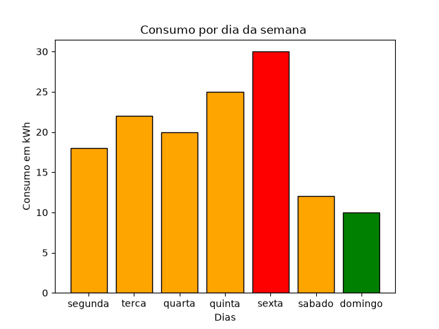

#  Métodos Numéricos com Python

Este projeto foi desenvolvido como resposta a uma atividade individual, com o objetivo de analisar o consumo de energia elétrica de uma sala de aula ao longo de 7 dias utilizando Python.

---

##  Objetivo

Realizar uma análise simples de dados de consumo energético, aplicando conceitos básicos de programação, como:

* Estruturas de dados (dicionário)
* Laços de repetição (`for`)
* Condicionais (`if`)
* Cálculos matemáticos
* Visualização de dados

---

##  Estrutura do Projeto

O projeto está dividido em duas partes:

###  Primeira Parte (`PrimeiraParte.py`)

Responsável pela análise dos dados:

* Armazena o consumo diário da semana
* Calcula o consumo total
* Calcula a média diária
* Identifica o maior consumo e o dia correspondente
* Identifica o menor consumo e o dia correspondente
* Lista os dias com consumo acima da média
* Calcula a porcentagem de redução do consumo no domingo em relação ao maior consumo

 Utiliza a biblioteca `colorama` para exibir os resultados em verde no terminal.

---

###  Segunda Parte (`SegundaParte.py`)

Responsável pela visualização dos dados:

* Gera um gráfico de barras com o consumo de cada dia da semana
* Utiliza a biblioteca `matplotlib`

---

##  Dados Utilizados

```python
consumo = {
    "segunda": 18,
    "terca": 22,
    "quarta": 20,
    "quinta": 25,
    "sexta": 30,
    "sabado": 12,
    "domingo": 10
}
```

---

##  Resultados (Saída do Terminal)

>  Observação: no terminal real, os valores aparecem na cor verde devido ao uso do `colorama`.

```bash
_________________________________________________________

2. Calcule o consumo total da semana

O consumo total da semana foi de 
137 kWh

_________________________________________________________

3. Calcule o consumo médio diário

A média do consumo diário é 19.571428571428573 
kWh por dia (valor truncado 19.57)

_________________________________________________________

4. Identifique o maior consumo e em qual dia ocorreu

O maior consumo foi sexta 
com 30 kWh

_________________________________________________________

5. Identifique o menor consumo e em qual dia ocorreu

O menor consumo foi domingo 
com 10 kWh

_________________________________________________________

6. Determine quais dias tiveram consumo acima da média

A média foi de 19.57
Os dias foram ['terca', 'quarta', 'quinta', 'sexta'] 
e os valores [22, 20, 25, 30]

_________________________________________________________

7. Calcule a porcentagem de redução do consumo no domingo em relação ao maior consumo

O percentual de redução foi de 66.66666666666666% 
ou arredondando 66.67%
```

---

##  Gráfico de Consumo




---

##  Tecnologias Utilizadas

* Python
* colorama
* matplotlib

---

##  Como Executar

1. Clone o repositório:

```bash
git clone https://github.com/seu-usuario/MetodosNumericosWithPy.git
```

2. Acesse a pasta:

```bash
cd MetodosNumericosWithPy
```

3. Instale as dependências:

```bash
pip install colorama matplotlib
```

4. Execute os arquivos:

```bash
python PrimeiraParte.py
python SegundaParte.py
```

---

##  Observações

* Certifique-se de ter o Python instalado
* Execute os comandos no terminal
* O gráfico será exibido em uma janela separada
* As saídas aparecem coloridas no terminal (verde) graças ao `colorama`

---

##  Autora

Projeto desenvolvido por **Giulia Cardoso** como parte de atividade acadêmica.

---

##  Status

✅ Concluído
📚 Uso educacional
